# Manga Quiz!
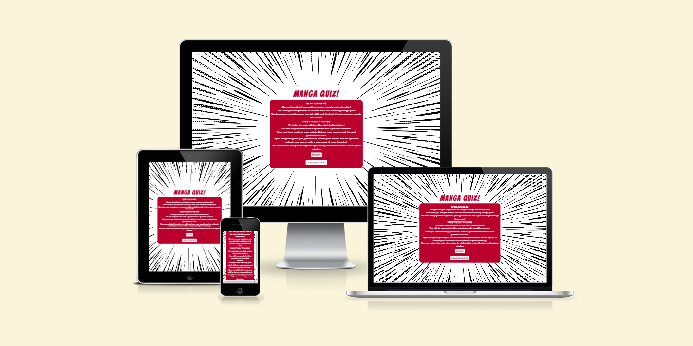

## Introduction

The manga quiz is a web based quiz game which tests users on their knowledge of Japanese anime and manga. The game is for fans of Japanese anime and manga, who want to see how big of a fan they actually are and maybe learn a few new facts along the way.

## UX

### User Goals
* Simple and easy to play.
* Fun and interesting quiz.
* Aesthetically pleasing design.
* Leaderboard of high scores.

### User Stories
* As a user, I want the quiz to be simple and easy to understand.
* As a user, I want the quiz to be fun and interesting.
* As a user, I want the site to have an interesting and captivating design.
* As a user, I want to find a leaderboard of current high scores.
* As a user, I want to test my knowledge of manga and learn interesting facts.

### Site Goals
* To create a quiz which is fun and interesting for users.
* To create an aesthetically pleasing quiz to captivate potential users.
* To create content which is entertaining to engage user.
* To make the quiz accessible to all potential users.

### Requirements
* Easy to play quiz.
* Aesthetically pleasing design.
* Interesting and entertaining content.
* Accessible to all potential users
* Leaderboard for high scores.

## Design Choices

### Fonts

[Google Fonts](https://fonts.google.com/ "Google Fonts") has been used to find a font for the main logo for the quiz which fits the overall theme and aesthetic. The font selected for the main logo is [Bangers](https://fonts.google.com/specimen/Bangers "Bangers") as it perfectly encapsulates the theme of Japanese anime and manga with it's comic book feel. [Fontjoy](https://fontjoy.com/ "Fontjoy") was then used to find a font to compliment [Bangers](https://fonts.google.com/specimen/Bangers "Bangers") to be used in the main body of the quiz. [BioRhyme](https://fonts.google.com/specimen/BioRhyme "BioRhyme") was selected from the [Fontjoy](https://fontjoy.com/ "Fontjoy") results as it was found to compliment the logo font well and also matches the theme of the quiz.

### Background Image

The background image was found on [freepik](https://www.freepik.com/ "freepik") and is of a zoom effect which you would find in a manga comic panel. This image not only fits the general theme of the quiz but creates a focus on centre of the screen where the quiz will be placed.

### Colours

Two colours which were preselected are the colours found in the Japanese flag. These are the colours of crimson and white. [Coolors](http://coolors.co "Coolors") was then used to lock in these 2 preselected colours and create a palette to be used for the quiz.

The colours and their uses are listed below.

* #BC002D - This colour is used for each window, main logo and some text.
* #FFFFFF - This colour is used for text and background colour for containers.
* #818F82 - This colour is used for box shadow on buttons when active.
* #FF7F11 - This colour is used for box shadow on button hover, prefix background and input text.
* #1AFF00 - This colour is used to highlight the option container when the correct answer is selected.
* #FF1515 - This colour is used to highlight the option container when the incorrect answer is selected.

### Structure

The structure of the site and quiz will be one of simplicity as to not deter the user from engaging with the content. On loading, the intitial content will be of a window containing a welcome message and instructions on how to progress through the quiz. The window will also contain a button to begin the quiz and one to access the leaderboard. 

Once the start button is clicked, the welcome window will no longer be displayed and will be replaced by the quiz window. Once the quiz is complete, a result window will replace the quiz window with a form to submit the score to the leaderboard. The result window will include a navigation button to return back to the welcome page.

The leaderboard can be accessed via the welcome window and will include a close button to hide leaderboard and replace with welcome window again.

## Wireframes

Wireframes have been created using [Balsamic](https://balsamiq.com "Balsamic"). These wireframes give a basic view of how the quiz will be laid out and structured. 

### Welcome Window
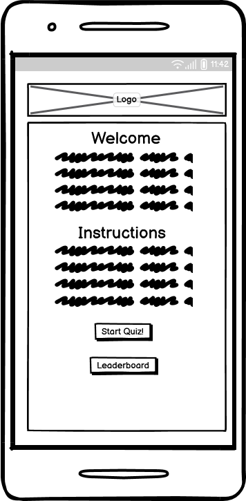 

### Game Window
 
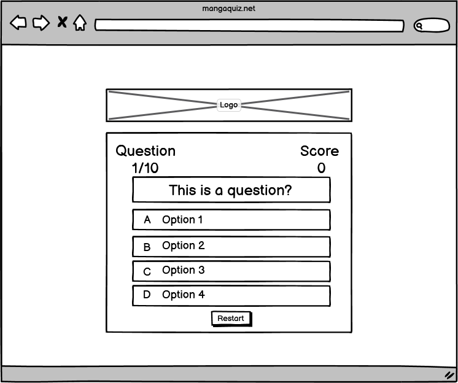

### Result Window
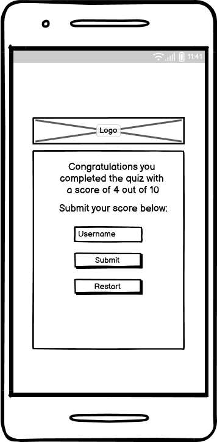 
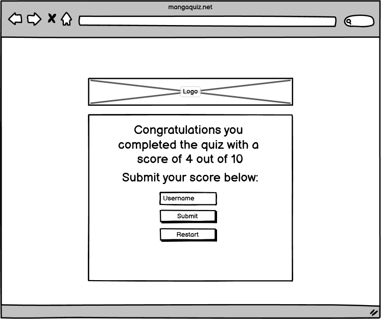

### Leaderboard Window
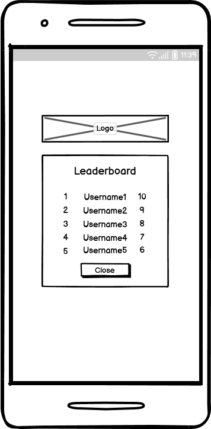 
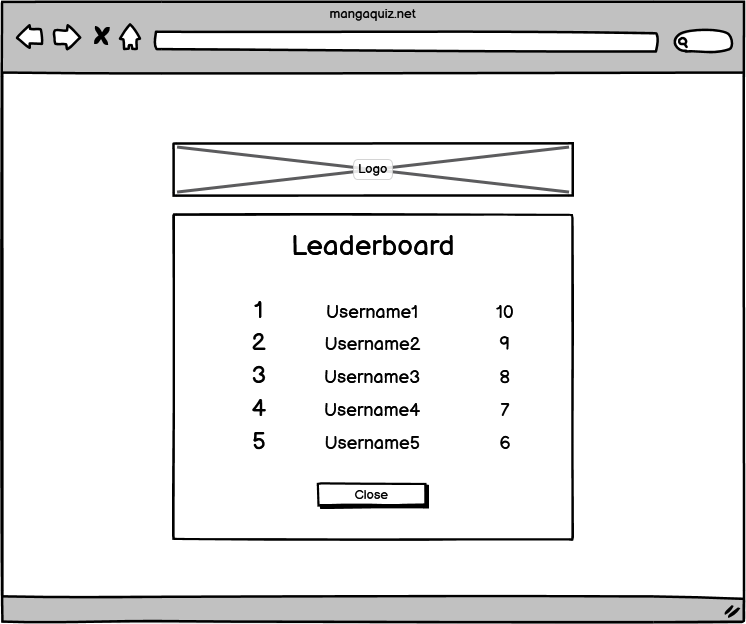

## Features

### Favicon

The favicon was created using the website [favicon.io](https://favicon.io/ "favicon.io"). It uses the same font as the logo and follows the same colour theme as the site. It gives a more polished feel to the website.

### Logo

The logo will is styled using the [Bangers](https://fonts.google.com/specimen/Bangers "Bangers") font and acts to immediately engage the user.

### Welcome Window

The welcome window will contain a welcome message for the user as well as three buttons. The three buttons are for starting the quiz, accessing the instructions and opening the leaderboard.

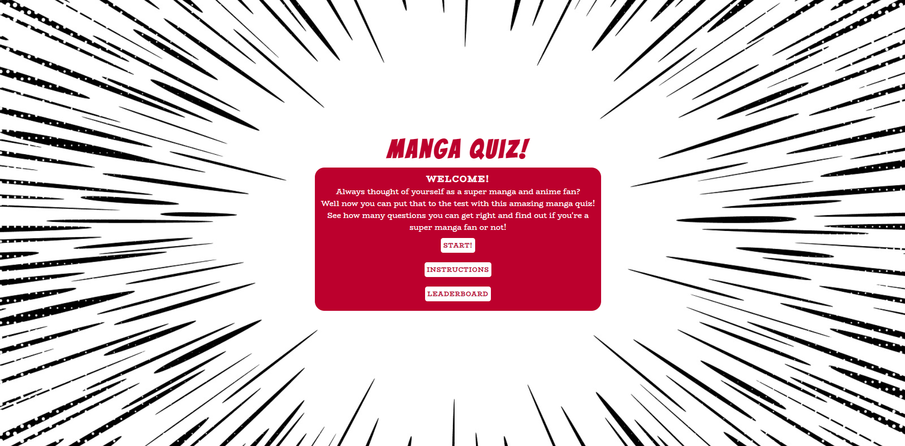

### Instructions Window

The instruction window gives the user some brief information on how to navigate through the quiz.

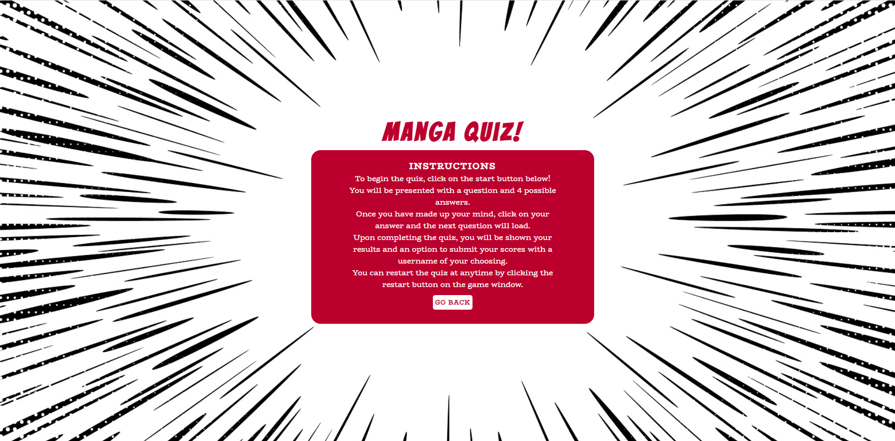

### Game Window

The game window will show the question counter and their current score at the top. Underneath will be the current question, followed by the 4 possible answers. Once the answer has been selected, the next question will be loaded, the question counter and current score (if necessary) will be updated. There will be a restart button underneath the answers to allow the user to start the quiz again, if they so wish.

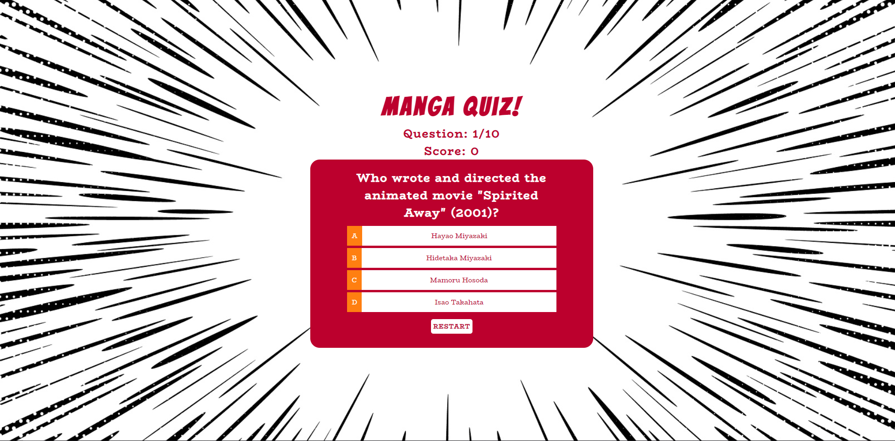

When the correct answer is selected, the background for the option container will change to green and red when the incorrect answer is selected.

### Result Window

The result window will show a congratulation, or commiseration message depending on the score the user achieved. The message will include the users score. There will be an input field for the user to add their username, along with a button to submit their score and if it is good enough, their score will be added to the leaderboard. A button to take the user back to the welcome window will be placed at the bottom. 

Should the user try to submit a score without first inputting a username, an alert message will be presented telling them to enter a username.

### Leaderboard Window

The leaderboard window can be accessed via a button on the welcome window. It will also be opened upon submitting a score. This will show the best 5 scores for the quiz. It will feature the username and their score on the leaderboard.

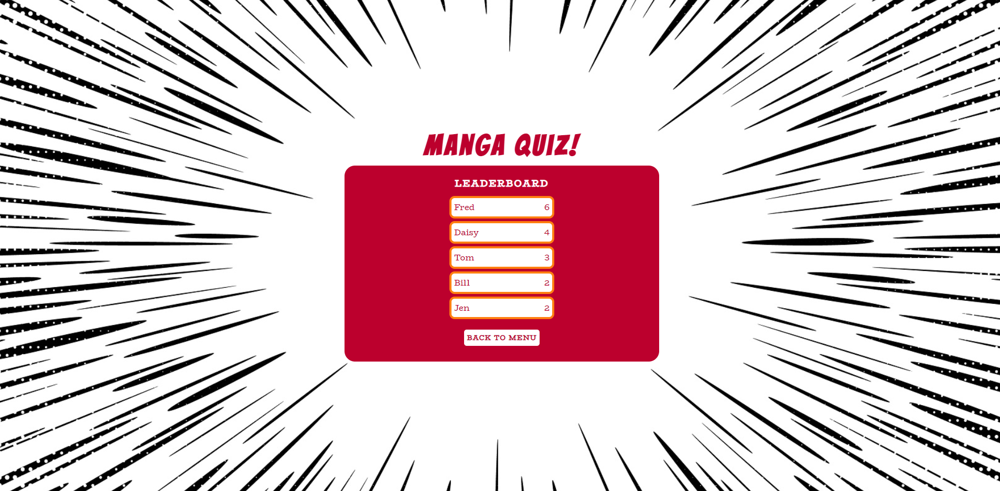

### 404 Page

The 404 page will alert the user if they have navigated to a broken link. It will redirect them back to the main page in 10 seconds but also has a link to do so if the redirect fails.

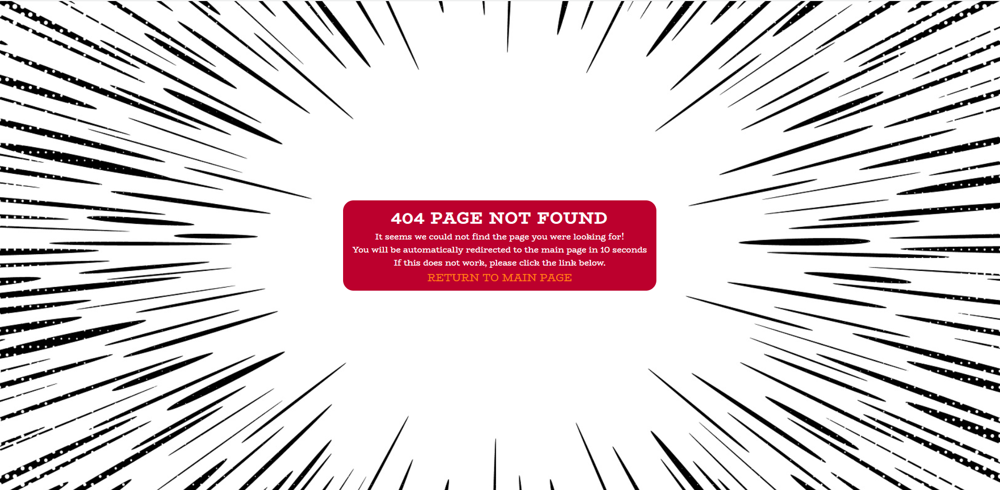

## Testing

### Feature Testing

#### Start Quiz Button
* Feature Description - Interactive button for starting the quiz.
* Expected Outcome - Upon click, user should be taken to quiz window, first question and counters should be presented.
* Testing - Start button was clicked
* Result - As expected

#### Open Instructions Button
* Feature Description - Interactive button for opening instructions.
* Expected Outcome - Upon click, instructions window should be presented.
* Testing - Open instructions button was clicked.
* Result - As expected.

#### Close Instructions Button
* Feature Description - Ineractive button for closing instructions.
* Expected Outcome - Upon click, instructions window should close and user taken back to welcome window.
* Testing - Open instructions window and then click close instructions button.
* Result - As expected.

#### Open Leaderboard Button
* Feature Description - Interactive button for opening leaderboard.
* Expected Outcome - Upon click, leaderboard window should be presented. Initially should be not show any scores until first score submitted.
* Testing - Open leaderboard button was clicked, no highscores shown on initial opening.
* Result - As expected.

#### Close Leaderboard Button
* Feature Description - Interactive button for closing leaderboard.
* Expected Outcome - Upon click, leaderboard window should close and user taken back to welcome window.
* Testing - Leaderboard window opened and then click close leaderboard button.
* Result - As expected.

#### Restart Quiz Button
* Feature Description - Interactive button for restarting quiz.
* Expected Outcome - Upon click, the user should be navigated back to welcome window, counters should be reset back to default values and questions refetched.
* Testing - Start quiz and answer a few questions, restart button clicked, use console log to check available questions and counter values.
* Result - As expected.

#### Question Counter
* Feature Description - Counter for questions to notify user which question they are on.
* Expected Outcome - Should start at 1 and increase by 1 after user has answered question.
* Testing - Start quiz and answer a few questions.
* Result - As expected.

#### Score Counter
* Feature Description - Counter for score to notify user of their current score.
* Expected Outcome - Should start at 0 and increase by 1 for every correct answer given.
* Testing - Start quiz and observe whether counter increases on correct answer and does not increase on incorrect answer.
* Result - As expected.

#### Answer Feedback
* Feature Description - Feedback to notify user if the selected answer was correct or incorrent.
* Expected Outcome - Upon answer being selected, if answer is correct, the option container should turn green, if incorrect it should turn red.
* Testing - Start quiz, selected correct answer and then select incorrect answer.
* Result - As expectdd.

#### Next Question Load
* Feature Description - Upon answering a question, the next question will be loaded.
* Expected Outcome - Upon answer of question and initial load, next question should be presented. The previously presented question should be removed from available questions.
* Testing - Start quiz and answer question. Console log available questions to see if previously presented question was removed from available questions.
* Result - As expected.

#### Result Window Load
* Feature Description - Upon answering 10 questions, the quiz will end and result window presented with final score.
* Expected Outcome - When all 10 questions have been answered, the quiz should end and results window should be presented with final score.
* Testing - Started and completed quiz.
* Result - As expected.

#### Result Message
* Feature Description - Result message dependent on user score.
* Expected Outcome - If the user scored less than 5, the result message should read **Bad Luck =[**. If score is 5 or higher, result message should read **Well Done! =]**.
* Testing - Complete quiz with a score of less than 5 and then with a score of 5 or higher.
* Result - As expected.

#### Submit Score
* Feature Description - Allows user to submit score upon entering a username and navigates them to leaderboard upon successful submission.
* Expected Outcome - If user submits highscore, score should be added to session storage and presented on leaderboard. No more than 5 highscores will be saved. Upon submission, if there is 5 scores already in high scores array, lowest score should be removed. Scores should be sorted from highest to lowest. Submitting score will not work if user has not given a username and alert message presented.
* Testing - Complete quiz more than 5 times with varying results. Attempted to submit score without username.
* Result - As expected.

#### Home Button
* Feature Description - Allows user to navigate back to welcome window from result window without submitting their score.
* Expected Outcome - User should be navigated back to welcome window from result window. Available questions should be refetched.
* Testing - Home button on result window clicked. Console log to check available questions have been refetched.
* Result - As expected. 

### Validator Testing

The HTML and CSS code have been validated using [W3C Markup Validation](https://validator.w3.org/#validate_by_input "W3C Markup Validation") and [W3C CSS Validation](https://jigsaw.w3.org/css-validator/#validate_by_input "W3C CSS Validation"). All code has validated successfully without errors.

*index.html validator result* 

*404.html validator result* 

*CSS validator result* 

The JavaScript code has been validated using [JSHint](https://jshint.com/ "JSHint") and produced the following results.

*JSHint result* 
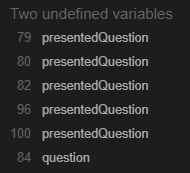

### Wave Testing

Testing has been completed using WAVE Web Accessibility Evaluation Tool to ensure the site is fully accessible to those with impairments. The test completed without errors.

*Wave testing result* 

The variables in question are found in the presentQuestion function. Due to time restrictions and the fact that the code is functioning correctly, it has been decided not to investigate further. If more time was available, some research into fixing this issue would be done.

### Lighthouse Testing

The lighthouse function within devtools has been used to test the site for mobile and desktop. The site achieved max scores across the board for desktop testing and an almost max score for mobile testing.

*Desktop Scores* 

*Mobile Scores* 

The mobile scores drop a point in performance due to the loading time for the background image. The recommended fix is to convert the background image to a different file type to reduce the file size and thus, speed up the loading time of the page. However due to time constraints and this being a minimal performance improvement, it has been decided that the file type will remain the same.

## Technologies Used

### Languages

* [HTML](https://en.wikipedia.org/wiki/HTML "HTML")
* [CSS](https://en.wikipedia.org/wiki/CSS "CSS")
* [JavaScript](https://en.wikipedia.org/wiki/JavaScript "JavaScript")

### Libraries & Framework

* [Google Fonts](https://fonts.google.com "Google Fonts")
* [freepik](https://www.freepik.com/ "freepik")

### Tools

* [GitHub](https://github.com "GitHub")
* [Gitpod](https://gitpod.io "Gitpod")
* [Balsamic](https://balsamiq.com "Balsamic")
* [Coolors](http://coolors.co "Coolors")
* [favicon.io](https://favicon.io/ "favicon.io")
* [DevTools](https://developer.chrome.com/docs/devtools "DevTools")
* [W3C Markup Validation](https://validator.w3.org/#validate_by_input "W3C Markup Validation")
* [W3C CSS Validation](https://jigsaw.w3.org/css-validator/#validate_by_input "W3C CSS Validation")
* [WAVE Web Accessibility Evaluation Tool](https://wave.webaim.org/ "WAVE Web Accessibility Evaluation Tool")

## Deployment

The site was deployed using GitHub. The steps for deployment are as follows:

1. Navigate to repository for GitHub project.
2. Navigate to settings tab.
3. Navigate to page settings under **Code and automation**.
4. Under **Build and deployment** select **Deploy from branch** as source.
5. Ensure the main branch is selected and click save.
6. After these steps have been completed, the page should go live within a few minutes.
7. Your live project will be viewable from http://**your-username**.github.io/**your-project-title**/

## Credits

The javascript code for saving of high scores and displaying them on the leaderboard was created by following this [tutorial](https://www.youtube.com/watch?v=DFhmNLKwwGw&ab_channel=JamesQQuick "tutorial") by [James Q Quick](https://www.youtube.com/@JamesQQuick "James Q Quick").

The shuffle array function used to shuffle the answers was found in a post on [dev.to](https://dev.to/codebubb/how-to-shuffle-an-array-in-javascript-2ikj "dev.to").

The background image as mentioned before was found on [freepik](https://www.freepik.com/ "freepik").

I would like to thank my mentor [Simen Daehlin](https://github.com/Eventyret "Simen Daehlin") for all his advice. For pushing me to learn new things and think outside the box.

I would also like to thank my friend [Marco](https://github.com/marconett "Marco") for all the help he gave me in troubleshooting issues with my project and his patience in helping me understand what I was doing.